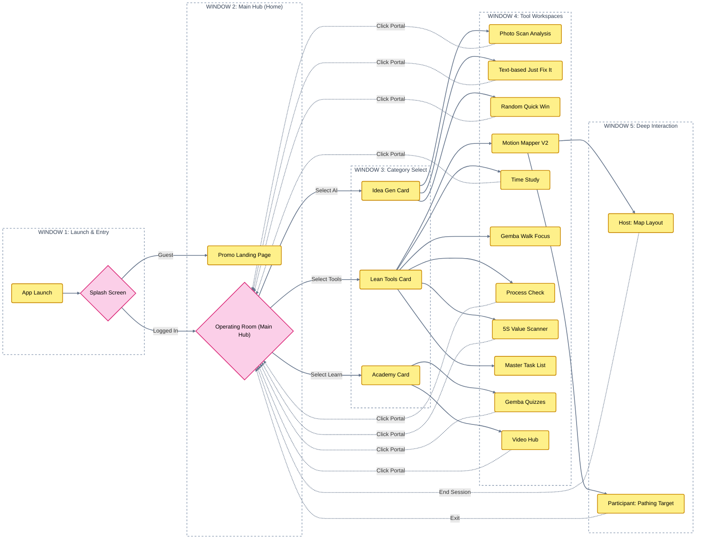

# GembaOS Button Tree & Process Map (Window Progression Edition)

This map is structured into strict **App Window Columns**, progressing deeper into the platform from left to right. It maps the forward progression of a user, and shows the explicit return paths back to the "Home" Operating Room via the persistent Left Navigation Rail.

